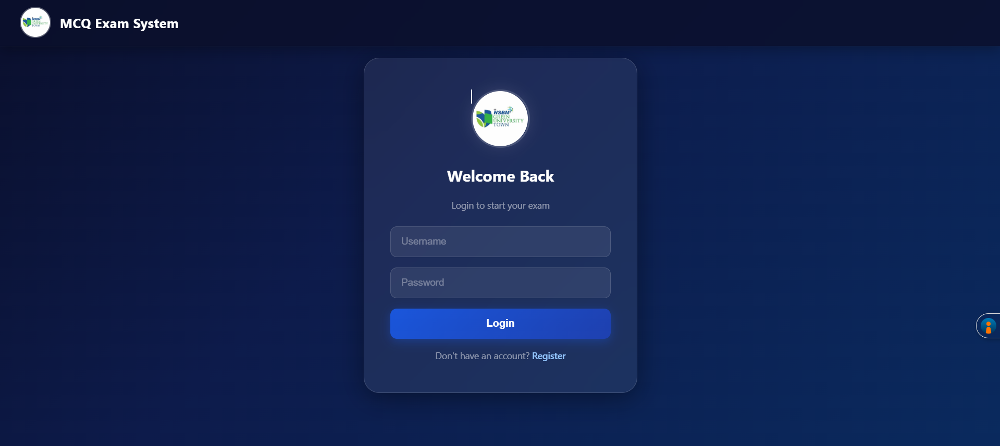
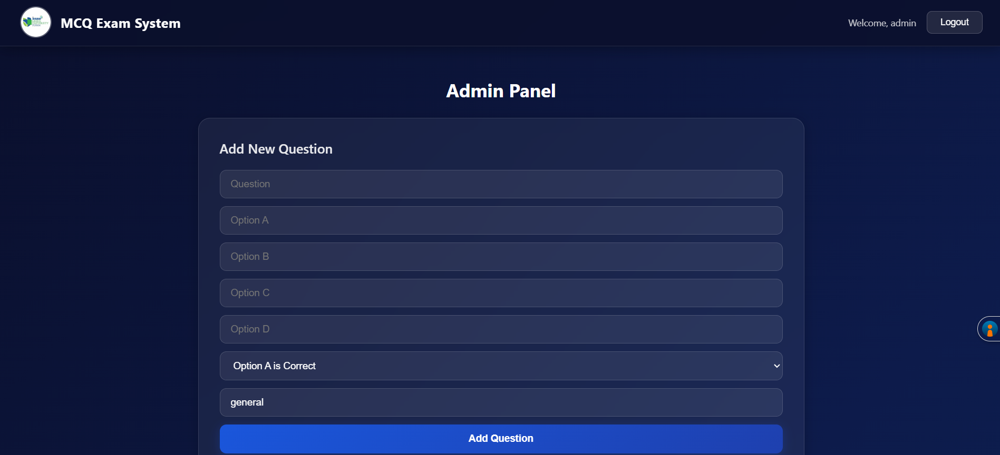

<div align="center">

<!-- Animated Header -->


<!-- Badges -->


<br/>

[](https://github.com/harshadulshan/NSBM-secured-mcq-exam-system)
[](https://github.com/harshadulshan/NSBM-secured-mcq-exam-system)

</div>

---

## ✨ Overview

> A **secure, modern, full-stack MCQ exam platform** built for NSBM Green University Town. Designed with a professional **Glassmorphism UI**, JWT-based authentication, real-time timer, and a complete admin panel — all powered by React and FastAPI.

---

## 🖼️ Screenshots

<div align="center">

### 🔐 Login Page


### 📝 Exam Page


### 📊 Result Page


### 🛠️ Admin Panel


</div>

---

## 🚀 Features

| Feature | Description |
|---|---|
| 🔐 JWT Authentication | Secure login and register with token-based auth |
| ⏱️ Live Countdown Timer | 30 minute exam timer with color warning |
| 📊 Progress Bar | Real-time answered question tracking |
| 🎓 Grade System | Automatic A, B, C, F grade calculation |
| 🛡️ Admin Panel | Add and delete questions through the browser |
| 💾 Result History | All exam results saved to database |
| 🌐 REST API | Full FastAPI backend with auto documentation |
| 🎨 Glassmorphism UI | Modern Midnight Blue frosted glass design |
| 📱 Responsive | Works on both mobile and desktop |

---

## 🛠️ Tech Stack

### Frontend
- ⚛️ React 18 with Vite
- 🔀 React Router DOM
- 📡 Axios
- 🎨 Custom CSS with Glassmorphism

### Backend
- ⚡ FastAPI
- 🗄️ SQLite with SQLAlchemy
- 🔑 JWT with python-jose
- 🔒 bcrypt for password hashing
- 🦄 Uvicorn ASGI server

---

## ⚙️ Getting Started

### Prerequisites
- Python 3.10+
- Node.js 18+
- Git

### 1️⃣ Clone the Repository
```bash

http://localhost:5173

---

## 🔐 Default Credentials

| Role | Username | Password |
|---|---|---|
| Admin | admin | admin123 |
| Student | register yourself | any password |

> To make a user admin, update the `is_admin` field in the database.

---

## 📂 Project Structure

NSBM-secured-mcq-exam-system/
│
├── backend/
│   └── app/
│       ├── database/     # DB connection and seed
│       ├── models/       # SQLAlchemy models
│       ├── routes/       # API route handlers
│       └── main.py       # FastAPI entry point
│
├── frontend/
│   └── src/
│       ├── api/          # Axios config
│       ├── components/   # Reusable UI components
│       ├── context/      # Auth context
│       ├── pages/        # Page components
│       └── assets/       # Logo and images
│
└── screenshots/          # Project preview images

---

## 📜 License

This project is open source and available under the [MIT License](LICENSE).

---

<div align="center">

### 👨‍💻 Developer

**Harsha Dulshan**
Final Year MIS Undergraduate | NSBM Green University
Founder — Kaldera Construction

[](https://github.com/harshadulshan)
[](https://linkedin.com/in/harshadulshan)

<br/>

⭐ Star this repo if you found it useful!


</div>
